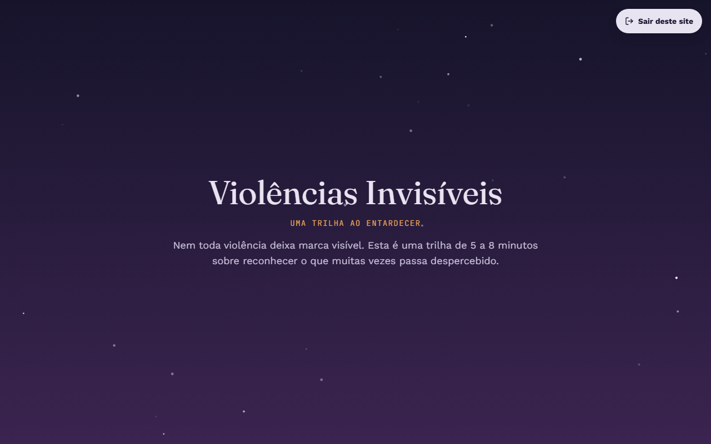
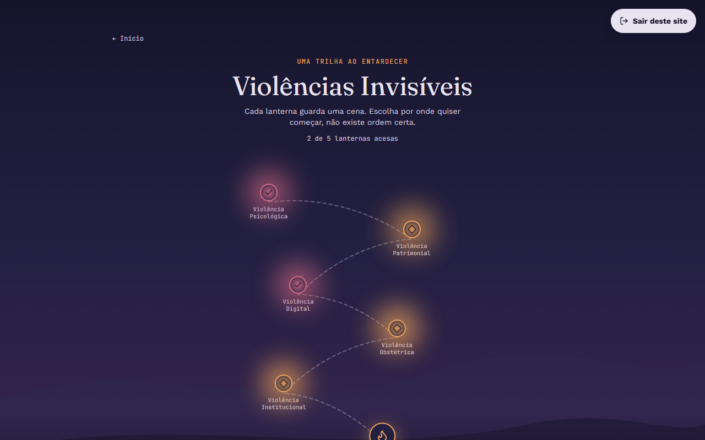
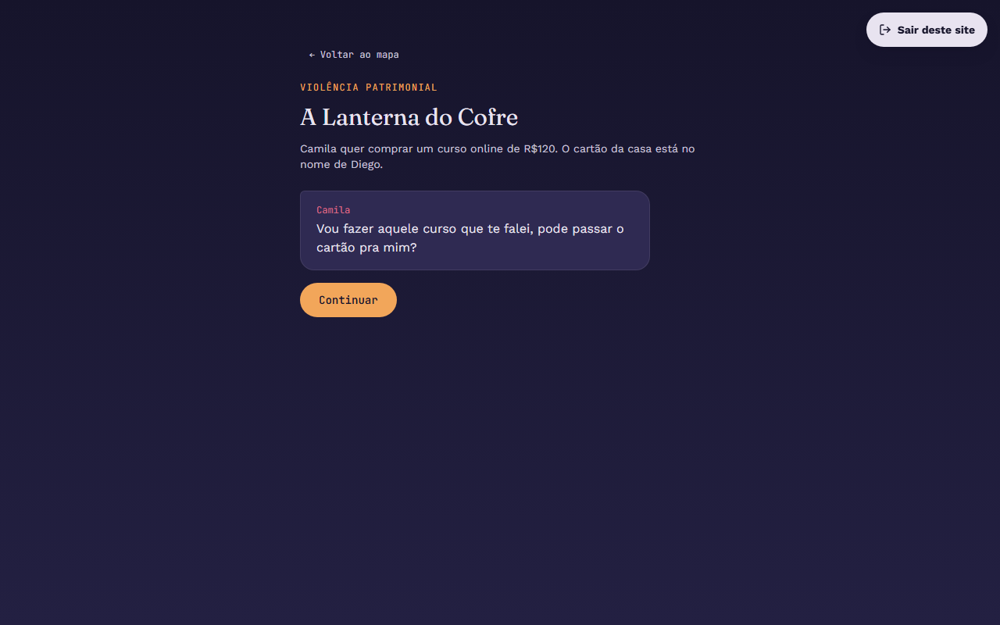
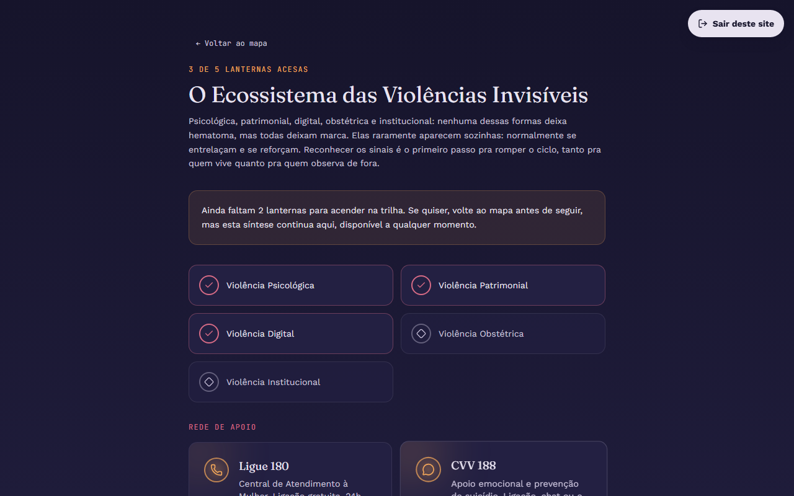

# Violências Invisíveis — Uma Trilha ao Entardecer

Uma trilha interativa por formas de violência doméstica que quase nunca deixam marca visível.


[](https://violencias-invisiveis.vercel.app)

**[Ver o projeto ao vivo](https://violencias-invisiveis.vercel.app)**

## Sobre o projeto

Este projeto nasceu de um briefing do CIEE que pedia uma peça de conscientização social. Entre os caminhos possíveis, escolhi a **Trilha de Ação Criativa e Lúdica**: em vez de um material informativo que se lê passivamente, uma experiência que a pessoa percorre e na qual toma decisões. A aposta é simples: quando alguém reconhece uma situação por dentro, antes de ela ter um nome técnico, o reconhecimento gruda de um jeito que um texto explicativo dificilmente alcança.

Dentro desse formato, o ecossistema de tema escolhido foi **violências invisíveis**: violência psicológica, patrimonial, digital, obstétrica e institucional. São formas previstas em lei e amplamente documentadas, mas que raramente deixam marca física. Por isso são mais difíceis de nomear, tanto por quem as vive quanto por quem observa de fora, e por isso mesmo costumam ser normalizadas ou minimizadas. O objetivo do projeto é dar nome a elas.

A execução traduz esse conceito na forma: o site é um mapa ao entardecer, com lanternas espalhadas. Cada lanterna acesa é uma cena curta do cotidiano que a pessoa atravessa antes de descobrir o nome do que acabou de ver. A metáfora de trazer luz para o que normalmente fica no escuro está na estética, na mecânica e no vocabulário da interface.

## Preview

| Home | Mapa da trilha |
| :---: | :---: |
|  |  |

| Cena de diálogo | Síntese e rede de apoio |
| :---: | :---: |
|  |  |

Capturas adicionais em [`docs/screenshots/`](docs/screenshots): seção de canais de ajuda, cena em formato de celular e card de revelação.

## Como funciona

A trilha é um **mapa de nós livres**. Não existe ordem correta nem progressão travada: a pessoa escolhe por onde começar e pode visitar as cinco lanternas na sequência que quiser.

Cada nó abre uma **cena curta do cotidiano**, não um texto expositivo. As cenas aparecem em três formatos, escolhidos conforme o tipo de violência que retratam:

- **Diálogo** — troca de falas com opções de resposta, para violências que acontecem na conversa (psicológica, patrimonial, institucional).
- **Celular** — a cena roda dentro da moldura de um smartphone, para a violência digital.
- **Narrativa** — texto corrido, sem escolhas, quando a ausência de escolha é justamente o ponto (violência obstétrica).

Nas cenas com opções, **nenhuma escolha é certa ou errada**. Elas mudam como a cena se desenrola, não se a pessoa "acertou". A leitura crítica vem sempre depois, num **card de revelação** que nomeia a violência, explica o mecanismo e lista os sinais de alerta.

A cena de violência obstétrica é precedida de um **aviso de conteúdo sensível**, com a opção de pular sem penalidade nenhuma no progresso.

Ao fim, a **fogueira** ao final do mapa abre uma síntese que amarra as cinco formas e reúne os canais de ajuda.

## Acessibilidade e segurança

O tema exige mais do que a acessibilidade de praxe, então essas decisões vieram junto com o código, não depois.

**Saída Rápida.** Um botão fixo, sempre visível e de alto contraste, presente em todas as telas. Um clique substitui a página atual por outro site usando `location.replace()`, sem deixar rastro no histórico de navegação. É um `<a href>` real, então funciona mesmo se o JavaScript falhar. Há também um atalho de teclado: **Esc duas vezes em menos de 1 segundo**. Na primeira visita, um aviso explica a feature e sugere limpar o histórico do navegador regularmente.

**Aviso de conteúdo sensível.** A cena de violência obstétrica só abre depois de um diálogo que descreve o tema e oferece a opção de pular.

**Movimento.** Toda a aplicação respeita `prefers-reduced-motion: reduce`. Nesse modo o scroll suave não é inicializado, as partículas não são renderizadas, as lanternas param de tremular e as transições vão direto ao estado final, sem nada ficar preso num estado intermediário.

**Teclado e leitores de tela.** Navegação completa por teclado com foco visível em âmbar em todos os controles, ordem de tabulação lógica (a Saída Rápida é sempre a primeira parada, de propósito), foco preso nos diálogos conforme o padrão ARIA Dialog, e status comunicado por ícone e texto além da cor, nunca só por cor.

**Toque.** Todos os alvos interativos têm no mínimo 44×44px em telas pequenas.

## Stack técnico

| Categoria | Tecnologias |
| --- | --- |
| **Core** | React 18, TypeScript, Vite |
| **Estilo** | Tailwind CSS v4 (design tokens via `@theme`), fontes Fraunces, Work Sans e JetBrains Mono |
| **Animação** | GSAP + ScrollTrigger (Home), Framer Motion (telas reativas a estado), Lenis (scroll suave), tsParticles (vagalumes) |
| **UI** | shadcn/ui sobre Radix (Dialog e Tooltip), lucide-react (ícones) |
| **Deploy** | Vercel |

A divisão entre GSAP e Framer Motion é deliberada: GSAP cuida da Home, onde as animações são de scroll e independem do estado do React; Framer Motion cuida de mapa, cenas e síntese, onde a animação é consequência direta de mudança de estado.

## Arquitetura

O estado global (view atual, nó ativo, progresso, escolhas) é gerenciado com **`useReducer` + Context API** nativos do React, sem Redux ou Zustand. O escopo do projeto é uma árvore de estado única, sem middlewares, dados assíncronos ou seletores otimizados. Nesse cenário, uma dependência externa de gerenciamento de estado adicionaria peso sem benefício real.

O progresso concluído é persistido em `localStorage` e sobrevive ao recarregamento. A navegação (view e nó ativo) não é persistida de propósito: recarregar a página sempre traz a pessoa de volta à Home.

O conteúdo narrativo vive isolado em `src/content/nodes.ts`, separado dos componentes que o renderizam. O roteiro pode ser revisado por alguém que não programa, e o motor de cenas escolhe a apresentação a partir do campo `kind` de cada nó, sem que os textos precisem saber nada sobre React.

Componentes do shadcn/ui aparecem apenas onde há padrão de acessibilidade complexo a respeitar (foco preso, ARIA Dialog). Todo o resto da interface é construído do zero sobre os design tokens do projeto.

## Estrutura do projeto

```
src/
├── components/
│   ├── Home/          # Hero, Sobre, Canais de Ajuda, Rodapé, partículas
│   ├── Map/           # Mapa da trilha e lanternas individuais
│   ├── Scenes/        # Motor de cenas, fluxo de beats, aviso de conteúdo
│   ├── Reveal/        # Card de revelação exibido ao fim de cada cena
│   ├── Summary/       # Tela de síntese e rede de apoio
│   ├── QuickExit/     # Saída Rápida: botão, atalho de teclado e aviso inicial
│   ├── shared/        # Componentes reaproveitados entre telas
│   └── ui/            # Primitivos do shadcn/ui (Dialog, Tooltip, Button)
├── content/           # Roteiro das cenas e canais de ajuda
├── context/           # Estado global do jogo (useReducer + Context)
├── types/             # Tipos compartilhados
├── lib/               # Utilitários
└── index.css          # Design tokens e estilos globais
```

## Como rodar localmente

```bash
git clone https://github.com/joaomenegonfcm-prog/violencias-invisiveis.git
cd violencias-invisiveis
npm install
npm run dev
```

Outros comandos:

```bash
npm run build
npm run preview
npm run lint
```

## Roadmap

- [x] Fase 0: Setup do projeto (Vite, Tailwind, fontes, tokens, shadcn/ui)
- [x] Fase 1: Tipos e estado global do jogo
- [x] Fase 2: Conteúdo (roteiro completo dos 6 nós)
- [x] Fase 3: Saída Rápida (feature de segurança)
- [x] Fase 4: Home completa (Hero, Sobre, CTA, Canais de Ajuda)
- [x] Fase 5: Mapa ilustrado da trilha
- [x] Fase 6: Motor de cenas (diálogo, celular, narrativa e revelação)
- [x] Fase 7: Síntese e rede de apoio
- [x] Fase 8: Polimento (responsividade, acessibilidade, reduced-motion)
- [x] Fase 9: Deploy (Vercel)
- [ ] Fase 10 (ideias futuras): áudio ambiente opcional, certificado de conclusão compartilhável, métricas de conclusão anônimas

## Créditos

Projeto acadêmico desenvolvido no âmbito do **CIEE / Jovem Aprendiz**.

Os canais de ajuda citados na aplicação são serviços públicos e organizações independentes, sem qualquer vínculo com este projeto.

## Licença

Distribuído sob a licença MIT. Veja [LICENSE](LICENSE) para o texto completo.
